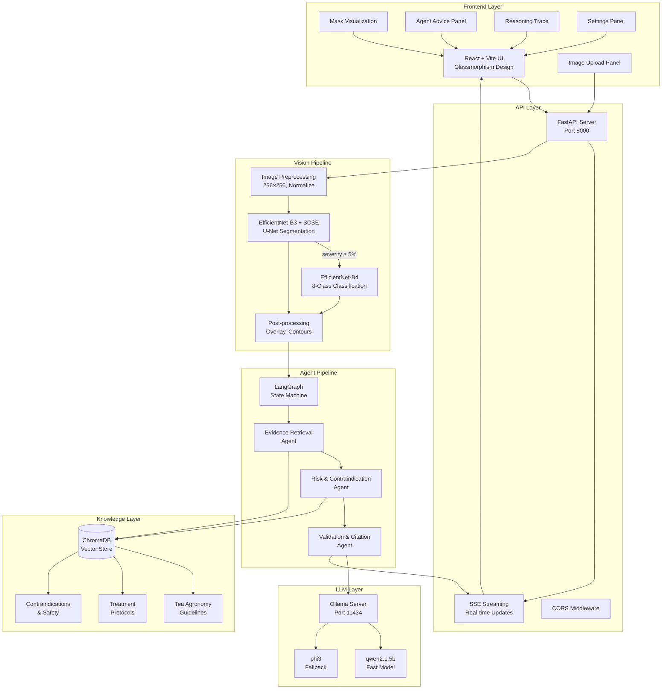
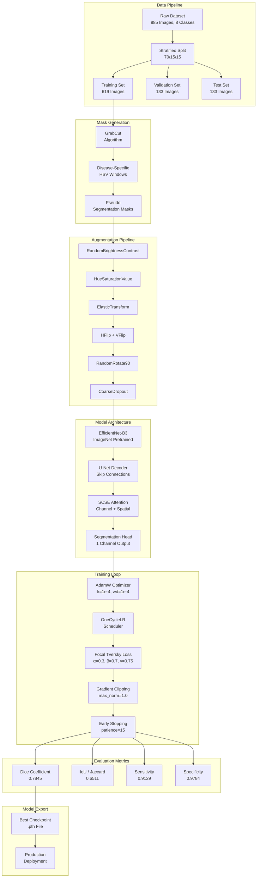
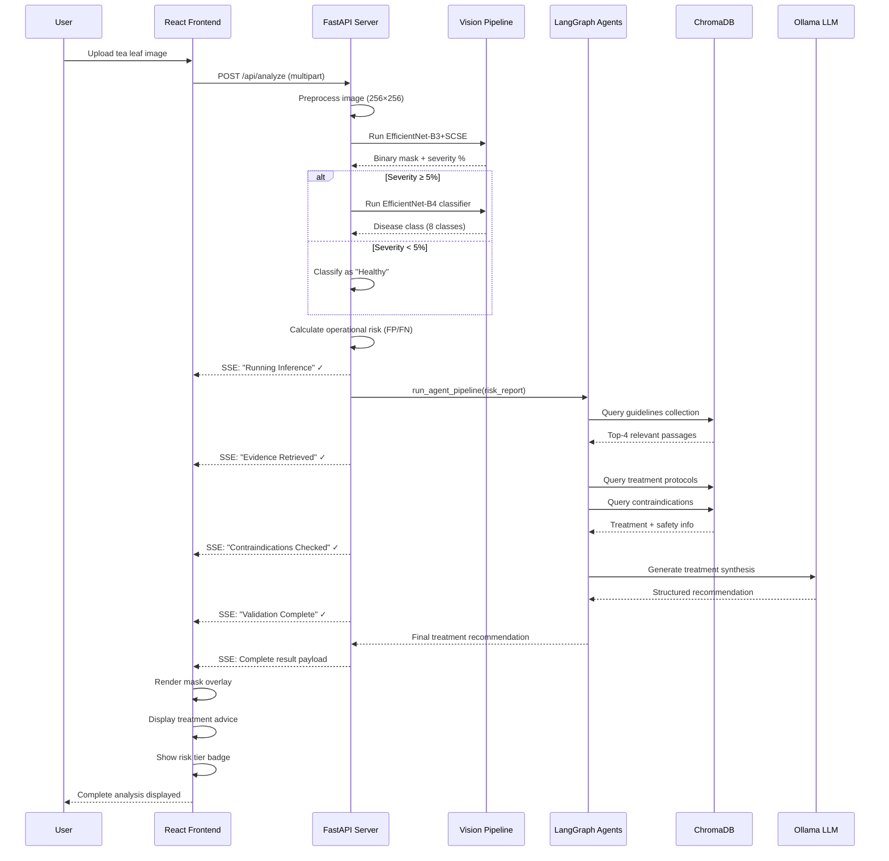
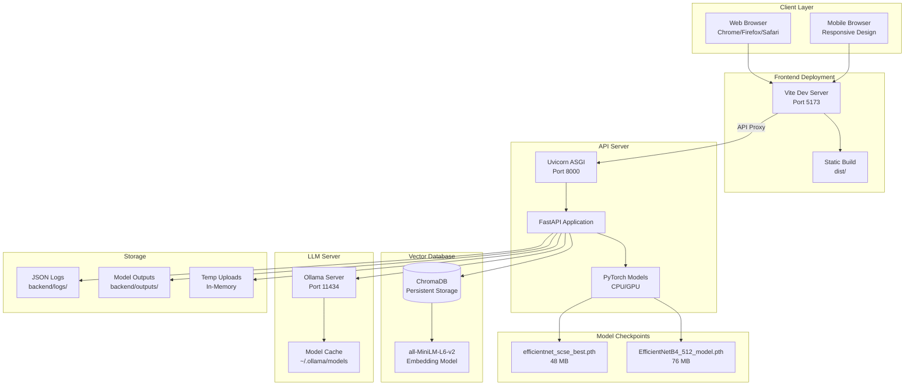
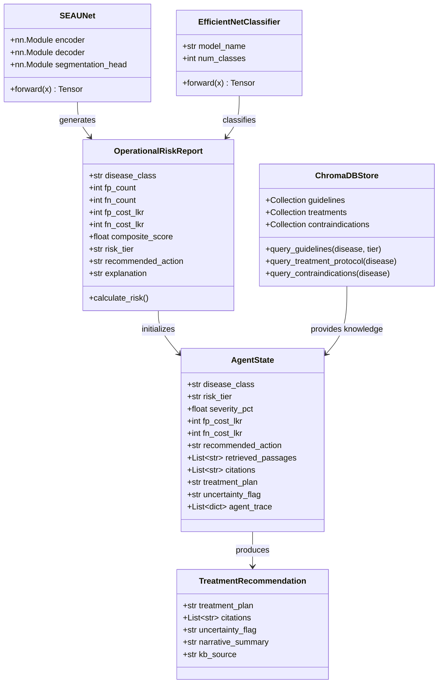

# TeaVision AI — Architecture Diagrams

> **Project:** BSc Data Science Capstone — NIBM, 2026
> **Author:** Manula Fernando
> **Last Updated:** February 2026

This document contains all formal architecture diagrams required for the technical report.

---

## 1. System Architecture Diagram

The high-level system architecture showing all major components and their interactions.



---

## 2. Data Flow Diagram

Shows the complete data flow from image upload to treatment recommendation.

```mermaid
flowchart LR
    subgraph Input
        IMG["Tea Leaf Image (RGB)"]
    end
    
    subgraph Preprocessing
        RESIZE["Resize 256x256"]
        NORM["Normalize ImageNet"]
        TENSOR["Convert to Tensor"]
    end
    
    subgraph Segmentation
        UNET["EfficientNet-B3 + SCSE"]
        SIGMOID["Sigmoid Activation"]
        THRESH["Threshold 0.5"]
        MASK["Binary Disease Mask"]
        SEVERITY["Calculate Severity"]
    end
    
    subgraph Decision
        CHECK{"Severity >= 5%?"}
    end
    
    subgraph Classification
        RESIZE512["Resize 512x512"]
        EFFNET["EfficientNet-B4"]
        SOFTMAX["Softmax 8 Classes"]
        DISEASE["Disease Class"]
    end
    
    subgraph RiskAnalysis
        FP["FP Cost ~LKR 2,500"]
        FN["FN Cost ~LKR 30,000"]
        RISK["Composite Risk Score"]
        TIER["Risk Tier"]
    end
    
    subgraph AgentPipeline
        RAG["ChromaDB RAG Query"]
        LLM["Ollama LLM Synthesis"]
        CITE["Citation Extraction"]
    end
    
    subgraph Output
        OVERLAY["Mask Overlay"]
        ADVICE["Treatment Recommendation"]
        CITATIONS["TRI Citations"]
        COSTS["FP/FN Cost Analysis"]
    end
    
    IMG --> RESIZE --> NORM --> TENSOR
    TENSOR --> UNET --> SIGMOID --> THRESH --> MASK
    MASK --> SEVERITY
    SEVERITY --> CHECK
    CHECK -->|Yes| RESIZE512 --> EFFNET --> SOFTMAX --> DISEASE
    CHECK -->|No| HEALTHY["Healthy Classification"]
    
    DISEASE --> FP
    DISEASE --> FN
    FP --> RISK
    FN --> RISK
    RISK --> TIER
    
    TIER --> RAG --> LLM --> CITE
    
    MASK --> OVERLAY
    CITE --> ADVICE
    CITE --> CITATIONS
    RISK --> COSTS
```



---

## 3. ML Pipeline Diagram

Detailed machine learning training and inference pipeline.



---

## 4. LangGraph Agent Interaction Diagram

Detailed view of the multi-agent orchestration system.

```mermaid
stateDiagram-v2
    [*] --> InputState
    
    state InputState {
        direction LR
        disease_class: str
        risk_tier: GREEN/AMBER/RED/CRITICAL
        severity_pct: float
        fp_cost_lkr: int
        fn_cost_lkr: int
    }
    note right of InputState : Risk Report from Vision Model
    
    InputState --> Agent1
    
    state Agent1 {
        [*] --> QueryGuidelines
        QueryGuidelines: Query ChromaDB
        QueryGuidelines: 'tea_agronomy_guidelines'
        QueryGuidelines --> RetrievePassages
        RetrievePassages: Retrieve Top-4
        RetrievePassages: Relevant Passages
        RetrievePassages --> ExtractCitations
        ExtractCitations: Extract TRI
        ExtractCitations: Source Citations
        ExtractCitations --> [*]
    }
    
    Agent1 --> Agent2: Passages + Citations
    
    state Agent2 {
        [*] --> QueryTreatment
        QueryTreatment: Query ChromaDB
        QueryTreatment: 'tea_treatment_protocols'
        QueryTreatment --> QueryContra
        QueryContra: Query ChromaDB
        QueryContra: 'tea_contraindications'
        QueryContra --> AnalyzeRisk
        AnalyzeRisk: Analyze MRL Limits
        AnalyzeRisk: PHI Days, Eco Buffers
        AnalyzeRisk --> [*]
    }
    
    Agent2 --> Agent3: Treatment + Contraindications
    
    state Agent3 {
        [*] --> CheckOllama
        CheckOllama: Check Ollama
        CheckOllama: Availability
        CheckOllama --> LLMSynth: Available
        CheckOllama --> RuleBased: Unavailable
        
        LLMSynth: Ollama LLM
        LLMSynth: qwen2:1.5b Synthesis
        
        RuleBased: Rule-Based
        RuleBased: Fallback Response
        
        LLMSynth --> FormatOutput
        RuleBased --> FormatOutput
        
        FormatOutput: Format 4-Section
        FormatOutput: Treatment Plan
        FormatOutput --> SetUncertainty
        SetUncertainty: Set Uncertainty
        SetUncertainty: Flag if Needed
        SetUncertainty --> [*]
    }
    
    Agent3 --> OutputState
    
    state OutputState {
        direction LR
        treatment_plan: str
        citations: List_str
        uncertainty_flag: str
        narrative_summary: str
        agent_trace: List_dict
    }
    note right of OutputState : Final Recommendation
    
    OutputState --> [*]
```



---

## 5. Component Interaction Diagram

Shows how all software components interact at runtime.



---

## 6. Deployment Architecture Diagram

Production deployment configuration.



---

## 7. Class Diagram — Core Domain Models



---

## Diagram Rendering Notes

These diagrams are written in **Mermaid** syntax and can be rendered:

1. **GitHub**: Automatically renders in README.md and markdown files
2. **VS Code**: Use "Markdown Preview Mermaid Support" extension
3. **Online**: Use [Mermaid Live Editor](https://mermaid.live)
4. **Report**: Export as PNG/SVG for PDF inclusion

### Export Commands (using Mermaid CLI)

```bash
# Install Mermaid CLI
npm install -g @mermaid-js/mermaid-cli

# Export to PNG
mmdc -i ARCHITECTURE_DIAGRAMS.md -o diagrams/ -e png

# Export to SVG (vector, better for reports)
mmdc -i ARCHITECTURE_DIAGRAMS.md -o diagrams/ -e svg
```

---

*Generated: February 2026*
